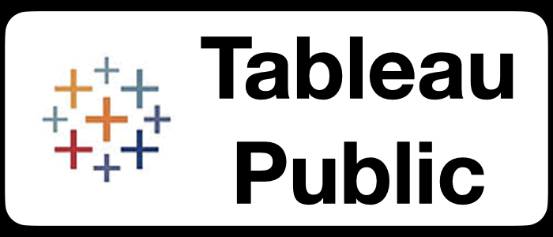

  <h2> "Data has better idea..." </h2>

  &nbsp;&nbsp;&nbsp;&nbsp;
  &nbsp;&nbsp;&nbsp;&nbsp;
  &nbsp;&nbsp;&nbsp;&nbsp;
  <a href="https://platzi.com/p/Jaime_EV/">&nbsp;&nbsp;&nbsp;&nbsp;
  &nbsp;&nbsp;&nbsp;&nbsp;

<h1 align="center">Hi, welcome</h1>

Data Science Fan, focused in find insights within any kind of data in order to help to make data driven decisions. I like the Arts ,the Technology and the intersection Between them.

- 🌱 I’m currently learning "Data Science"
- 👯 I’m looking to collaborate on "Any Data Project (great Data Music)"
- 💬 Ask me about Music, Python, Jupyter Notebooks
- ⚡ Curious fact: Some People Are Scared of Left-Handedness!. Sinistrophobia is defined as the fear of things at the left side or left-handed people.(I am left-handed)
- ✨ Contact: escobedo.v.jaime@gmail.com
---

<h3>🛠 Dev Tools</h3>

---

<h3>👨‍💻 Stack & Skills</h3>

<h3>GitHub Stats</h3>

 
 

